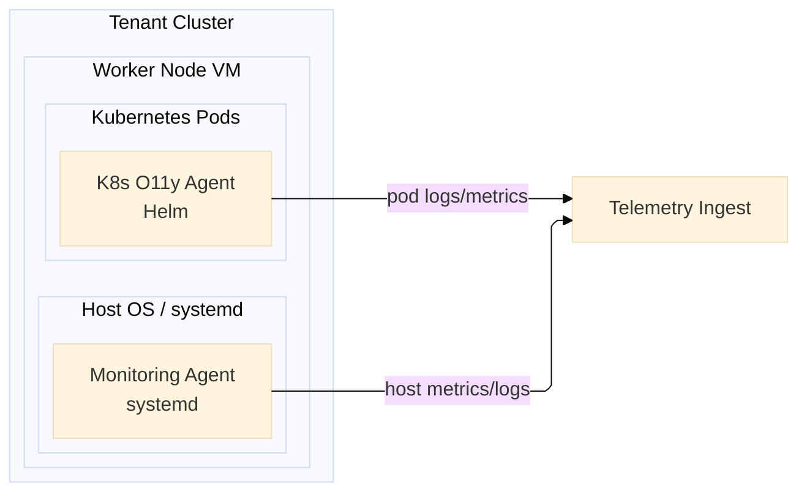

# Rendering Rules

## Mermaid / LangGraph-Style Overview

Use Mermaid for the overview when the graph has containers, ownership boundaries, or many crossing relations.

Recommended shape:

Rules:

- Prefer `flowchart LR` for system topology.
- Use `subgraph` for real containment.
- Use ELK renderer when available.
- Keep overview nodes coarse; do not include every pod, service, and backend table.

## React Flow Detail Views

Use React Flow for scoped detail views.

Rules:

- Start from the same semantic graph.
- Select a scope first, then render only that scope.
- Use ELK, dagre, or another layout engine to compute node positions.
- Use React Flow for dragging, selection, panels, filtering, and zoom.
- Keep container nodes non-draggable; keep operational nodes draggable.
- Prefer visible badges for `deployedAs` and `telemetryKind`.

Avoid:

- One global React Flow with all nodes and all edges.
- Manual coordinate tweaking as the primary layout strategy.
- Long cross-container edges in the same detail scope unless they are the subject of that scope.

## Edge Density

If edges overlap nodes:

1. Verify whether the edge belongs in this scope.
2. Split the scope into a narrower view.
3. Use source/target handles that match layout direction.
4. Add explicit routed edges only after reducing scope.
5. Re-run browser geometry QA.
